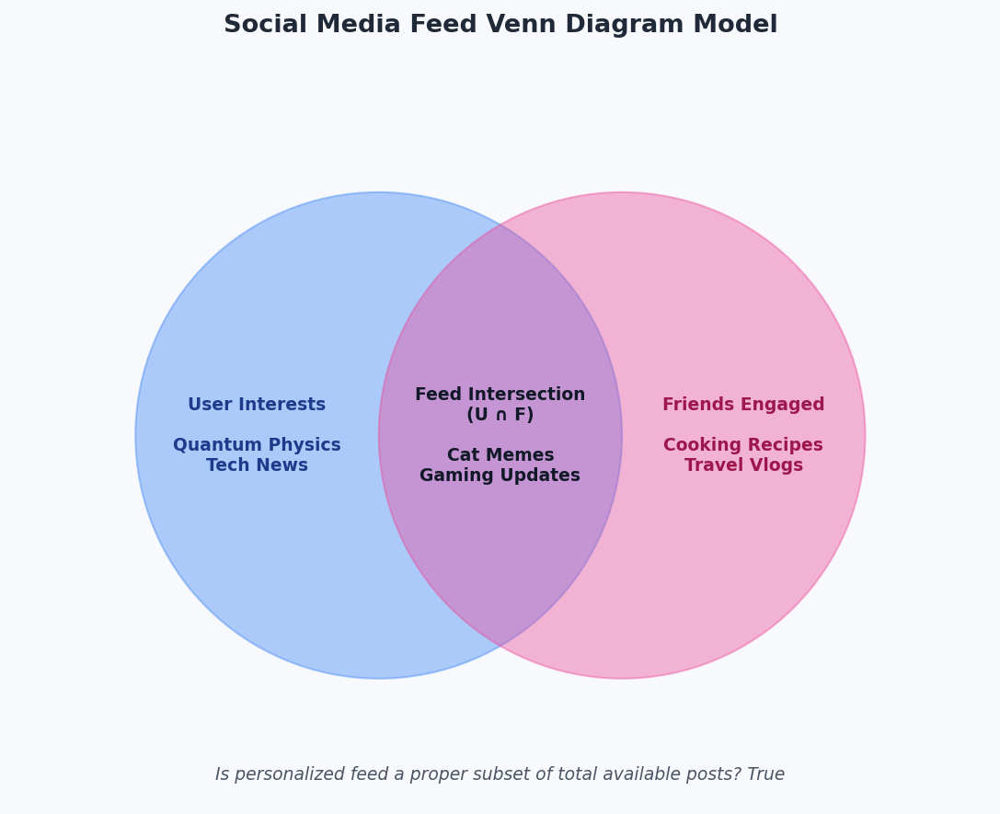

# Conjunto e Subconjuntos (Sets and Subsets)

Este módulo aborda os conceitos essenciais da Teoria dos Conjuntos focando na definição de conjuntos, relações de pertinência e inclusão, e o Conjunto das Partes.

## Conceitos Teóricos Básicos

### 1. Definição de Conjunto e Elemento
Um conjunto é uma coleção bem definida de objetos, chamados de elementos.
* **Pertinência ($\in$):** Se um objeto $x$ é elemento de um conjunto $A$, dizemos que $x$ pertence a $A$ ($x \in A$). Caso contrário, $x$ não pertence a $A$ ($x \notin A$).

### 2. Relação de Inclusão e Subconjuntos
Um conjunto $A$ é um **subconjunto** de $B$ (indica-se por $A \subseteq B$) se e somente se todo elemento de $A$ também é elemento de $B$.
* **Subconjunto Próprio ($\subset$):** $A$ é subconjunto próprio de $B$ se $A \subseteq B$ e $A \neq B$ (ou seja, existe pelo menos um elemento em $B$ que não pertence a $A$).
* **Propriedades da Inclusão:**
  * **Reflexiva:** $A \subseteq A$ para qualquer conjunto $A$.
  * **Antissimétrica:** Se $A \subseteq B$ e $B \subseteq A$, então $A = B$.
  * **Transitiva:** Se $A \subseteq B$ e $B \subseteq C$, então $A \subseteq C$.
  * **Conjunto Vazio:** $\emptyset \subseteq A$ para qualquer conjunto $A$.

### 3. Conjunto das Partes ($\mathcal{P}(A)$)
O conjunto das partes de um conjunto $A$, denotado por $\mathcal{P}(A)$, é o conjunto que contém todos os subconjuntos possíveis de $A$.
* Se um conjunto finito $A$ possui $n$ elementos, o seu conjunto das partes $\mathcal{P}(A)$ possuirá exatamente $2^n$ elementos.
* Exemplo: Se $A = \{1, 2\}$, então $\mathcal{P}(A) = \{\emptyset, \{1\}, \{2\}, \{1, 2\}\}$.

## Estudo de Caso: Feed de Notícias como Diagrama de Venn

Com base no documento de apoio `analisematematicacaos.pdf`, analisamos a personalização de feeds de notícias de redes sociais sob a ótica da Teoria dos Conjuntos:
* **Conjunto U (Interesses do Usuário):** Tópicos ou postagens de interesse direto do usuário.
* **Conjunto F (Engajamento de Amigos):** Postagens engajadas pelo círculo social do usuário.
* **Feed Personalizado ($U \cap F$):** A interseção dos interesses do usuário com as atividades dos amigos. Representa o que de fato será exibido.
* **Subconjunto Próprio:** O feed resultante é validado como subconjunto próprio de todas as postagens disponíveis no sistema ($Feed \subset Total$).

### Ilustração Visual do Módulo
A simulação gera o Diagrama de Venn representativo desse algoritmo de feed:



### Mapa Mental Interativo
Para consolidar os estudos de Teoria dos Conjuntos e Funções aplicadas à computação, criamos um **Mapa Mental Interativo** dinâmico e moderno em Português.

* Acesse e abra o arquivo em seu navegador para explorar os nós e códigos interativos: [mapa_mental.html](./mapa_mental.html)

---

## Como Executar o Código deste Módulo

Para rodar a simulação e gerar o gráfico utilizando o ambiente virtual (`.venv`), execute o seguinte comando na raiz do projeto:

```bash
.venv/bin/python 01_conjunto_subconjuntos/app.py
```
